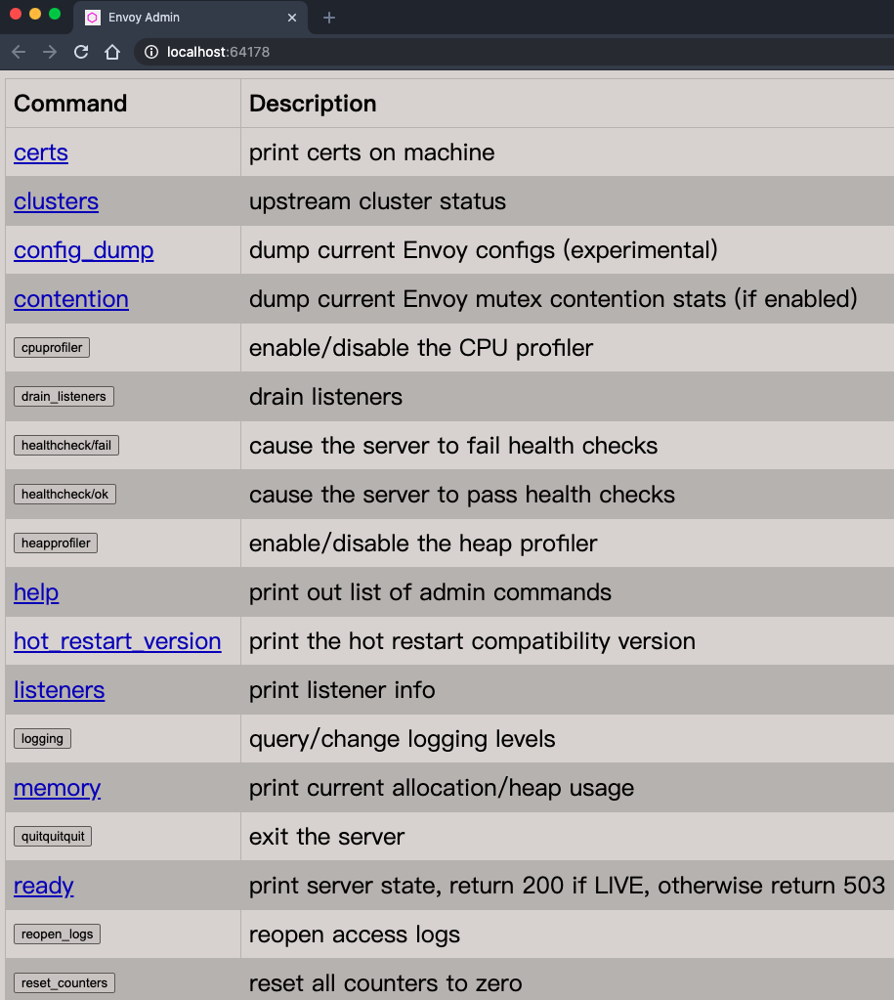

* content
{:toc}

## envoyfilter

istio从1.5开始引入envoyfilter，支持直接修改envoy的配置文件。

官网： <https://istio.io/latest/docs/reference/config/networking/envoy-filter/>

istio自身带了四个：

```bash
# kubectl get envoyfilter -n istio-system
NAME                               AGE
metadata-exchange-1.6-1-6-10       8d
stats-filter-1.6-1-6-10            8d
tcp-metadata-exchange-1.6-1-6-10   8d
tcp-stats-filter-1.6-1-6-10        8d
```

看其中的一个的完整内容：

```yaml
spec:
  configPatches:
  - applyTo: HTTP_FILTER
    match:
      context: SIDECAR_OUTBOUND
      listener:
        filterChain:
          filter:
            name: envoy.http_connection_manager
            subFilter:
              name: envoy.router
      proxy:
        proxyVersion: ^1\.6.*
    patch:
      operation: INSERT_BEFORE
      value:
        name: istio.stats
        typed_config:
          '@type': type.googleapis.com/udpa.type.v1.TypedStruct
          type_url: type.googleapis.com/envoy.extensions.filters.http.wasm.v3.Wasm
          value:
            config:
              configuration: |
                {
                  "debug": "false",
                  "stat_prefix": "istio"
                }
              root_id: stats_outbound
              vm_config:
                code:
                  local:
                    inline_string: envoy.wasm.stats
                runtime: envoy.wasm.runtime.null
                vm_id: stats_outbound
  - applyTo: HTTP_FILTER
    match:
      context: SIDECAR_INBOUND
      listener:
        filterChain:
          filter:
            name: envoy.http_connection_manager
            subFilter:
              name: envoy.router
      proxy:
        proxyVersion: ^1\.6.*
    patch:
      operation: INSERT_BEFORE
      value:
        name: istio.stats
        typed_config:
          '@type': type.googleapis.com/udpa.type.v1.TypedStruct
          type_url: type.googleapis.com/envoy.extensions.filters.http.wasm.v3.Wasm
          value:
            config:
              configuration: |
                {
                  "debug": "false",,
                  "stat_prefix": "istio"
                }
              root_id: stats_inbound
              vm_config:
                code:
                  local:
                    inline_string: envoy.wasm.stats
                runtime: envoy.wasm.runtime.null
                vm_id: stats_inbound
  - applyTo: HTTP_FILTER
    match:
      context: GATEWAY
      listener:
        filterChain:
          filter:
            name: envoy.http_connection_manager
            subFilter:
              name: envoy.router
      proxy:
        proxyVersion: ^1\.6.*
    patch:
      operation: INSERT_BEFORE
      value:
        name: istio.stats
        typed_config:
          '@type': type.googleapis.com/udpa.type.v1.TypedStruct
          type_url: type.googleapis.com/envoy.extensions.filters.http.wasm.v3.Wasm
          value:
            config:
              configuration: |
                {
                  "debug": "false",
                  "stat_prefix": "istio",
                  "disable_host_header_fallback": true
                }
              root_id: stats_outbound
              vm_config:
                code:
                  local:
                    inline_string: envoy.wasm.stats
                runtime: envoy.wasm.runtime.null
                vm_id: stats_outbound
```

支持项如下：

```bash
EnvoyFilter
EnvoyFilter.ProxyMatch
EnvoyFilter.ClusterMatch
EnvoyFilter.RouteConfigurationMatch
EnvoyFilter.ListenerMatch
EnvoyFilter.Patch
EnvoyFilter.EnvoyConfigObjectMatch
EnvoyFilter.EnvoyConfigObjectPatch
EnvoyFilter.RouteConfigurationMatch.RouteMatch
EnvoyFilter.RouteConfigurationMatch.VirtualHostMatch
EnvoyFilter.ListenerMatch.FilterChainMatch
EnvoyFilter.ListenerMatch.FilterMatch
EnvoyFilter.ListenerMatch.SubFilterMatch
EnvoyFilter.RouteConfigurationMatch.RouteMatch.Action
EnvoyFilter.Patch.Operation
EnvoyFilter.ApplyTo
EnvoyFilter.PatchContext
```

## 如何调试istio envoy

三种方法：

1. 通过curl获取配置文件

15000是 envoy admin 端口

```bash
kubectl exec reviews-v1-6d8bc58dd7-ts8kw -c istio-proxy curl http://127.0.0.1:15000/config_dump > config_dump
```
config_dump可以改成listener,cluster,endpoint,route,secret

2. 通过 istioctl来操作

同理支持查询config listener, cluster, endpoint, route, secret

```bash
$ istio-1.6.10/bin/istioctl proxy-config
A group of commands used to retrieve information about proxy configuration from the Envoy config dump

Usage:
  istioctl proxy-config [command]

Aliases:
  proxy-config, pc

Examples:
  # Retrieve information about proxy configuration from an Envoy instance.
  istioctl proxy-config <clusters|listeners|routes|endpoints|bootstrap> <pod-name[.namespace]>

Available Commands:
  bootstrap   Retrieves bootstrap configuration for the Envoy in the specified pod
  cluster     Retrieves cluster configuration for the Envoy in the specified pod
  endpoint    Retrieves endpoint configuration for the Envoy in the specified pod
  listener    Retrieves listener configuration for the Envoy in the specified pod
  log         (experimental) Retrieves logging levels of the Envoy in the specified pod
  route       Retrieves route configuration for the Envoy in the specified pod
  secret      (experimental) Retrieves secret configuration for the Envoy in the specified pod
```

如：

```bash
 $ istio-1.6.10/bin/istioctl proxy-config cluster  productpage-v1-5fbd5fdfcc-qwd7b.ns4

SERVICE FQDN                                                                               PORT      SUBSET         DIRECTION     TYPE
BlackHoleCluster                                                                           -         -              -             STATIC
InboundPassthroughClusterIpv4                                                              -         -              -             ORIGINAL_DST
PassthroughCluster                                                                         -         -              -             ORIGINAL_DST
admission-server-svc.openebs.svc.cluster.local                                             443       -              outbound      EDS
agent                                                                                      -         -              -             STATIC
alerting-client-server.kubesphere-alerting-system.svc.cluster.local                        9200      -              outbound      EDS
alerting-manager-server.kubesphere-alerting-system.svc.cluster.local                       9200      -              outbound      EDS
```

3. 还可以通过直接通过admin页面来访问

```bash
$ istio-1.6.10/bin/istioctl dashboard envoy kubesphere-router-ns4-6d4c9fb7fc-v9xjj.kubesphere-controls-system

http://localhost:64178
```

然后打开admin管理页面

  

页面上可以查看命令行的结果，不过会更直观些。

### 如何查看一个Pod的监控信息？

首先，我们使用istioctl dashboard功能，看下envoy config

```bash
$ istio-1.6.10/bin/istioctl dashboard envoy productpage-v1-8f795f448-pf47f.ns4
http://localhost:63398
```
